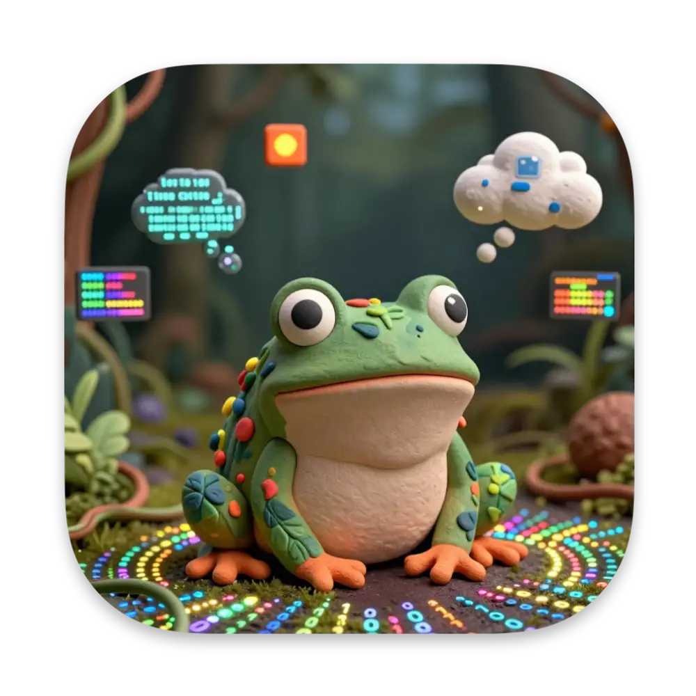

# Coqui Bot



Terminal AI agent with multi-model orchestration, persistent sessions, and runtime extensibility via Composer.

Coqui is a CLI-first AI assistant that lives in your terminal. Ask it questions, delegate coding tasks, manage packages, execute PHP, and extend its abilities on the fly — powered by [php-agents](https://github.com/carmelosantana/php-agents) and any mix of locally hosted or cloud LLMs.

> Coqui is a WIP and under rapid development. Be careful when running this tool. Always test in a safe environment.

Join the [Discord community](https://discord.gg/TaCpZVqbbT) to follow along, ask questions, and share your creations!

## Features

- **Multi-model orchestration** — route tasks to the right model: cheap local models for orchestration, powerful cloud models for coding and review
- **Persistent sessions** — SQLite-backed conversations that survive restarts; resume where you left off
- **Workspace sandboxing** — all file I/O is sandboxed to a `.workspace` directory, keeping your project safe
- **Runtime extensibility** — install Composer packages at runtime and Coqui auto-discovers new toolkits
- **Child agent delegation** — spawns specialized agents (coder, reviewer) using role-appropriate models
- **Interactive approval** — dangerous operations (package installs, shell exec, PHP execution) require your confirmation
- **Credential management** — secure `.env`-based secret storage; values are never exposed to the LLM
- **Script sanitization** — static analysis blocks dangerous functions before any generated code runs
- **Memory persistence** — saves facts to `MEMORY.md` across sessions so Coqui remembers what matters
- **Observer pattern** — real-time terminal rendering of agent lifecycle events with nested child output
- **OpenClaw config** — natively supports the OpenClaw config format for centralized model routing and workspace settings

## Requirements

- PHP 8.4 or later
- Extensions: `curl`, `json`, `mbstring`, `pdo_sqlite`
- Composer 2.x
- [Ollama](https://ollama.ai) (recommended for local inference)

## Installation

```bash
git clone https://github.com/AgentCoqui/coqui.git
cd coqui
composer install
```

## Quick Start

```bash
./bin/coqui
```

That's it. Coqui starts a REPL session and you can start chatting:

```txt
 Coqui v0.1.0

 Session  a3f8b2c1
 Model    ollama/glm-4.7-flash:latest
 Project  /home/you/projects/my-app
 Workspace /home/you/projects/my-app/.workspace

 Type /help for commands, /quit to exit.

 You > Summarize the README.md file
 ▸ Using: read_file(path: "README.md")
 ✓ Done

 The README describes a PHP application that...
```

> Make sure Ollama is running: `ollama serve` and a model is pulled: `ollama pull glm-4.7-flash`

### CLI Options

| Option | Short | Description |
|--------|-------|-------------|
| `--config` | `-c` | Path to `openclaw.json` config file |
| `--new` | | Start a fresh session |
| `--session` | `-s` | Resume a specific session by ID |
| `--workdir` | `-w` | Working directory (default: current directory) |

## REPL Commands

Once inside the Coqui REPL, use slash commands:

| Command | Description |
|---------|-------------|
| `/new` | Start a new session |
| `/history` | Show conversation history |
| `/sessions` | List all saved sessions |
| `/resume <id>` | Resume a session by ID |
| `/model [role]` | Show model configuration |
| `/help` | List available commands |
| `/quit` `/exit` `/q` | Exit Coqui |

## Providers & OpenClaw Config

Coqui uses an `openclaw.json` config file for centralized model routing. It supports three providers out of the box:

### Provider Setup

```php
// Ollama (local — no API key needed)
"ollama": {
    "baseUrl": "http://localhost:11434/v1",
    "apiKey": "ollama-local",
    "api": "openai-completions"
}

// OpenAI
"openai": {
    "baseUrl": "https://api.openai.com/v1",
    "apiKey": "your-openai-api-key",
    "api": "openai-completions"
}

// Anthropic
"anthropic": {
    "baseUrl": "https://api.anthropic.com/v1",
    "apiKey": "your-anthropic-api-key",
    "api": "anthropic"
}
```

Set your API keys as environment variables or directly in `openclaw.json`:

```bash
export OPENAI_API_KEY="sk-..."
export ANTHROPIC_API_KEY="sk-ant-..."
```

### Role-Based Model Routing

The real power is in role-to-model mapping. Assign the best model for each job:

```json
{
    "agents": {
        "defaults": {
            "model": {
                "primary": "ollama/glm-4.7-flash:latest",
                "fallbacks": ["ollama/qwen3-coder:latest"]
            },
            "roles": {
                "orchestrator": "openai/gpt-4.1",
                "coder": "anthropic/claude-opus-4-6",
                "reviewer": "openai/gpt-4o-mini"
            }
        }
    }
}
```

The orchestrator runs on a cost-effective model for routing and simple tasks, then delegates to expensive models only when needed — keeping costs low while maintaining quality where it counts.

### Model Aliases

Define short aliases for quick reference:

```json
{
    "models": {
        "ollama/qwen3:latest": { "alias": "qwen" },
        "anthropic/claude-opus-4-6": { "alias": "opus" },
        "openai/gpt-4.1": { "alias": "gpt4.1" }
    }
}
```

## Built-in Tools

Coqui ships with a rich set of tools the agent can use autonomously:

### Custom Tools

| Tool | Description |
|------|-------------|
| `spawn_agent` | Delegate tasks to specialized child agents (coder, reviewer) using role-appropriate models |
| `composer` | Manage Composer dependencies at runtime — require, remove, update, audit, with framework denylist |
| `credentials` | Secure credential management via `.env` — values are never exposed to the LLM |
| `packagist` | Search Packagist for packages by keyword, popularity, advisories |
| `package_info` | Introspect installed packages — read READMEs, list classes, inspect method signatures |
| `php_execute` | Execute generated PHP code in a sandboxed subprocess with script sanitization |

### Inherited Toolkits (from php-agents)

| Toolkit | Description |
|---------|-------------|
| `FilesystemToolkit` | Sandboxed read/write to the `.workspace` directory |
| `ShellToolkit` | Run shell commands from project root (`git`, `grep`, `find`, `cat`, `ls`, etc.) |
| `MemoryToolkit` | Persistent memory via `MEMORY.md` for facts that survive across sessions |

## Extending Coqui

Coqui auto-discovers toolkits from installed Composer packages. Create a package that implements `ToolkitInterface` and Coqui picks it up automatically.

### 1. Implement `ToolkitInterface`

```php
<?php

declare(strict_types=1);

namespace Acme\BraveSearch;

use CarmeloSantana\PHPAgents\Contract\ToolkitInterface;

final class BraveSearchToolkit implements ToolkitInterface
{
    public function tools(): array
    {
        return [$this->buildSearchTool()];
    }

    public function guidelines(): string
    {
        return 'Use brave_search to find current information from the web.';
    }
}
```

### 2. Register in `composer.json`

```json
{
    "extra": {
        "php-agents": {
            "toolkits": [
                "Acme\\BraveSearch\\BraveSearchToolkit"
            ]
        }
    }
}
```

### 3. Install and go

```bash
composer require acme/brave-search
```

Coqui discovers the toolkit on next startup — no configuration needed.

### Safety

Coqui blocks full-framework packages from being installed (`laravel/*`, `symfony/symfony`, `laminas/*`, etc.) to keep the runtime lean and secure. A `ScriptSanitizer` blocks dangerous functions (`eval`, `exec`, `system`, `passthru`, etc.) in any generated PHP code before execution.

## Community

We're building a community where people share agents, ask for help, and collaborate on new toolkits.

- **Discord** — [Join us](https://discord.gg/TaCpZVqbbT) for support, discussions, and sharing your toolkits
- **GitHub** — [AgentCoqui/coqui](https://github.com/AgentCoqui/coqui) for issues, PRs, and source code

## Contributing

We'd love your help making Coqui even mightier:

- **Build new toolkits** — create Composer packages that implement `ToolkitInterface`
- **Add child agent roles** — define new specialized roles with tailored system prompts
- **Improve tools** — enhance existing tools or add new ones in `src/Tool/`
- **Write tests** — expand coverage in `tests/Unit/`
- **Fix bugs & improve docs** — every contribution counts

See [AGENTS.md](AGENTS.md) for code conventions and architecture guidelines.

## License

MIT
