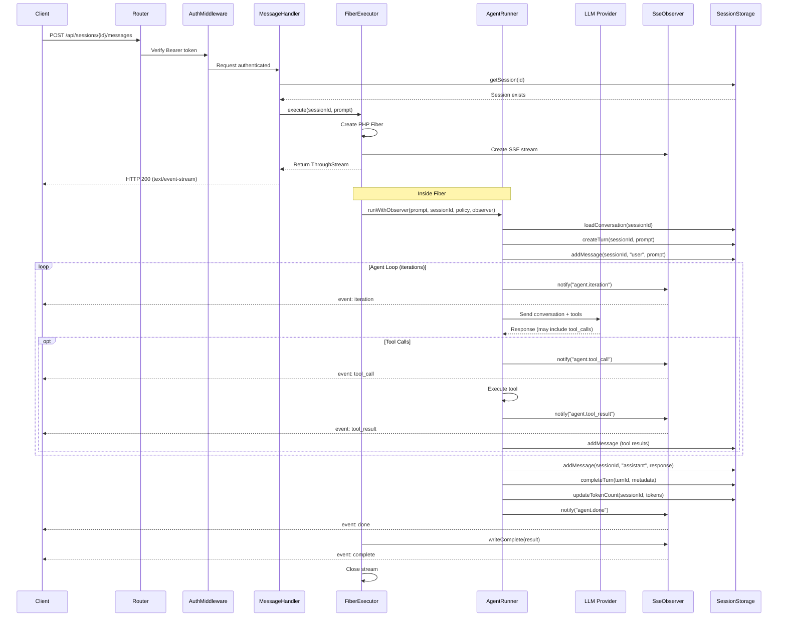

# Building Applications with the Coqui API

This guide explains how Coqui works internally and how to build applications that communicate with it over HTTP. It covers the data model, session and turn lifecycle, streaming, concurrency, and provides tested examples for every operation.

## Architecture Overview

Coqui is a terminal AI agent powered by PHP 8.4. The API server exposes its capabilities over HTTP so external applications (mobile apps, web dashboards, CI pipelines) can create conversations, send prompts, and receive real-time streaming responses.

```
┌───────────────────────────────────────────────────────────────────────┐
│                          Client Application                         │
│                  (Flutter, Web App, CLI, CI Script)                  │
└──────────────────────────────┬────────────────────────────────────────┘
                               │  HTTP / SSE
                               ▼
┌───────────────────────────────────────────────────────────────────────┐
│                        Coqui API Server                             │
│  ┌─────────┐  ┌──────────────┐  ┌────────────┐  ┌───────────────┐  │
│  │  Router  │→│  Middleware   │→│  Handlers   │→│  Fiber Exec.  │  │
│  │         │  │ (CORS, Auth) │  │ (15 routes) │  │  (per-turn)   │  │
│  └─────────┘  └──────────────┘  └──────┬─────┘  └───────┬───────┘  │
│                                        │                 │          │
│  ┌─────────────────────────────────────┴─────────────────┘          │
│  │                                                                  │
│  ▼                                                                  │
│  ┌──────────────┐  ┌──────────────┐  ┌────────────────────────────┐ │
│  │ AgentRunner  │→│  LLM Provider │→│  Tool Execution Pipeline   │ │
│  │  (per turn)  │  │ (OpenAI, etc)│  │  (filesystem, shell, PHP) │ │
│  └──────┬───────┘  └──────────────┘  └────────────────────────────┘ │
│         │                                                           │
│         ▼                                                           │
│  ┌──────────────┐  ┌──────────────┐                                 │
│  │ SseObserver  │  │SessionStorage│                                 │
│  │ (stream out) │  │  (SQLite DB) │                                 │
│  └──────────────┘  └──────────────┘                                 │
└───────────────────────────────────────────────────────────────────────┘
```

### Request Lifecycle

When your application sends a prompt to the API:

1. **Router** matches the HTTP method and path to a handler.
2. **Middleware** runs in order: CORS headers, rate limiting, request-size check, content-type validation, then API key verification.
3. **Handler** validates the request body and delegates to the executor.
4. **AgentFiberExecutor** creates a PHP Fiber, instantiates an `SseObserver`, and starts the agent.
5. **AgentRunner** loads the conversation history from SQLite, creates the agent with all tools, and enters the agent loop.
6. The agent calls the LLM provider, receives tool calls, executes tools (with safety checks), and iterates until done.
7. **SseObserver** streams each event (tool calls, results, iterations) to the HTTP response as SSE.
8. **SessionStorage** persists everything: the user prompt, assistant response, tool calls, token counts, and timing.

## Core Concepts

### Sessions

A **session** is a persistent conversation context. It has a unique 32-character hex ID, a model role (which model to use), and tracks cumulative token usage. Sessions persist across server restarts because they live in SQLite.

Think of a session as a chat thread. Your application creates one session per conversation, and all messages within that conversation share the same session ID.

```
Session "a1b2c3..."
├── Message 1: user → "What files are in src/?"
├── Message 2: assistant → "Here are the files..."
├── Message 3: user → "Show me the Router class"
└── Message 4: assistant → "The Router class handles..."
```

**Key properties:**

| Field | Type | Description |
|-------|------|-------------|
| `id` | string (32 hex chars) | Unique identifier, generated server-side |
| `model_role` | string | Role name that maps to a model (e.g. "orchestrator") |
| `model` | string | Resolved model ID (e.g. "openai/gpt-5") |
| `created_at` | ISO 8601 timestamp | When the session was created |
| `updated_at` | ISO 8601 timestamp | Last activity timestamp |
| `token_count` | integer | Cumulative tokens used across all turns |

### Turns

A **turn** is a single prompt-response cycle within a session. When you send a prompt, the agent may iterate multiple times (calling tools, spawning child agents) before producing a final response. The entire cycle from prompt to final response is one turn.

Turns are numbered sequentially within a session (turn 1, turn 2, ...) and each has its own unique hex ID. They record detailed metadata: token usage breakdown, duration, which tools were used, and how many child agents were spawned.

```
Session "a1b2c3..."
├── Turn 1 (turn_number: 1)
│   ├── user_prompt: "What files are in src/?"
│   ├── iterations: 2
│   ├── tools_used: ["list_dir"]
│   ├── duration_ms: 4521
│   └── response_text: "Here are the files..."
│
└── Turn 2 (turn_number: 2)
    ├── user_prompt: "Show me the Router class"
    ├── iterations: 3
    ├── tools_used: ["read_file", "grep"]
    ├── duration_ms: 8200
    └── response_text: "The Router class handles..."
```

**Key properties:**

| Field | Type | Description |
|-------|------|-------------|
| `id` | string (32 hex chars) | Unique identifier |
| `session_id` | string | Parent session |
| `turn_number` | integer | Sequential number within session (1-based) |
| `user_prompt` | string | The user's input |
| `response_text` | string | The agent's final response |
| `model` | string | Model used for this turn |
| `prompt_tokens` | integer | Input tokens consumed |
| `completion_tokens` | integer | Output tokens generated |
| `total_tokens` | integer | Total tokens (prompt + completion) |
| `iterations` | integer | Number of agent loop iterations |
| `duration_ms` | integer | Wall-clock time in milliseconds |
| `tools_used` | JSON string | Array of tool names invoked |
| `child_agent_count` | integer | Number of child agents spawned |
| `created_at` | ISO 8601 | When the turn started |
| `completed_at` | ISO 8601 | When the turn finished |

### Messages

Messages are the individual records within a conversation. Each turn produces multiple messages: the user prompt, any tool calls and tool results, and the final assistant response. Messages have roles (`user`, `assistant`, `tool`, `system`) and are linked to both a session and a turn.

### Relationship Hierarchy

```
Session (1)
 └── Turn (many, sequential)
      └── Message (many, per turn)
           ├── user message (the prompt)
           ├── assistant message (may include tool_calls)
           ├── tool message (tool execution result)
           └── assistant message (final response)
```

## Data Storage

All state is stored in a single SQLite database at `.workspace/data/coqui.db`. The database uses WAL mode for concurrent read performance and enforces foreign keys for referential integrity.

### Schema

```sql
-- Conversations / chat threads
CREATE TABLE sessions (
    id          TEXT PRIMARY KEY,           -- 32-char hex
    model_role  TEXT NOT NULL,              -- e.g. "orchestrator"
    model       TEXT NOT NULL,              -- e.g. "openai/gpt-5"
    created_at  TEXT NOT NULL,              -- ISO 8601
    updated_at  TEXT NOT NULL,              -- ISO 8601
    token_count INTEGER DEFAULT 0           -- cumulative tokens
);

-- Individual messages in a conversation
CREATE TABLE messages (
    id           TEXT PRIMARY KEY,          -- 32-char hex
    session_id   TEXT NOT NULL,             -- FK → sessions.id
    role         TEXT NOT NULL,             -- user | assistant | tool | system
    content      TEXT NOT NULL,             -- message body
    tool_calls   TEXT,                      -- JSON array of tool call objects
    tool_call_id TEXT,                      -- for tool-result messages
    turn_id      TEXT,                      -- FK → turns.id
    created_at   TEXT NOT NULL,             -- ISO 8601
    FOREIGN KEY (session_id) REFERENCES sessions(id) ON DELETE CASCADE
);

-- Prompt-response cycles with metadata
CREATE TABLE turns (
    id                TEXT PRIMARY KEY,     -- 32-char hex
    session_id        TEXT NOT NULL,        -- FK → sessions.id
    turn_number       INTEGER NOT NULL,     -- sequential within session
    user_prompt       TEXT NOT NULL,        -- what the user sent
    response_text     TEXT,                 -- final agent response
    model             TEXT,                 -- model used
    prompt_tokens     INTEGER DEFAULT 0,
    completion_tokens INTEGER DEFAULT 0,
    total_tokens      INTEGER DEFAULT 0,
    iterations        INTEGER DEFAULT 0,    -- agent loop iterations
    duration_ms       INTEGER DEFAULT 0,    -- wall-clock time
    tools_used        TEXT,                 -- JSON array of tool names
    child_agent_count INTEGER DEFAULT 0,
    created_at        TEXT NOT NULL,        -- ISO 8601
    completed_at      TEXT,                 -- ISO 8601
    FOREIGN KEY (session_id) REFERENCES sessions(id) ON DELETE CASCADE
);

-- Child agent executions within a turn
CREATE TABLE child_runs (
    id               TEXT PRIMARY KEY,
    session_id       TEXT NOT NULL,
    parent_iteration INTEGER NOT NULL,     -- which iteration spawned this
    agent_role       TEXT NOT NULL,         -- e.g. "coder", "reviewer"
    model            TEXT NOT NULL,
    prompt           TEXT NOT NULL,
    result           TEXT NOT NULL,
    token_count      INTEGER DEFAULT 0,
    created_at       TEXT NOT NULL,
    FOREIGN KEY (session_id) REFERENCES sessions(id) ON DELETE CASCADE
);

-- Tool execution audit trail
CREATE TABLE audit_log (
    id         TEXT PRIMARY KEY,
    session_id TEXT,
    tool_name  TEXT NOT NULL,
    arguments  TEXT NOT NULL,              -- JSON
    action     TEXT NOT NULL,              -- approved | denied | blocked | auto_approved
    reason     TEXT,
    turn_id    TEXT,
    created_at TEXT NOT NULL,
    FOREIGN KEY (session_id) REFERENCES sessions(id) ON DELETE SET NULL
);
```

### Indexes

```sql
CREATE INDEX idx_messages_session   ON messages(session_id);
CREATE INDEX idx_messages_turn      ON messages(turn_id);
CREATE INDEX idx_turns_session      ON turns(session_id);
CREATE INDEX idx_child_runs_session ON child_runs(session_id);
CREATE INDEX idx_audit_log_session  ON audit_log(session_id);
CREATE INDEX idx_audit_log_action   ON audit_log(action);
CREATE INDEX idx_audit_log_turn     ON audit_log(turn_id);
```

## How the API Server Works Internally

### Component Interaction



### Concurrency Model

The API server uses PHP Fibers for concurrency. Each prompt submission runs inside its own Fiber, which means:

- The ReactPHP event loop remains responsive while an agent is running.
- Multiple sessions can have active agent runs at the same time.
- A single session can only have one active run at a time (concurrent prompts to the same session return HTTP 409).

```
Event Loop (single thread)
├── Fiber A: Session "abc..." running agent turn
│   └── Blocked on HTTP call to OpenAI → event loop services other requests
├── Fiber B: Session "def..." running agent turn
│   └── Blocked on HTTP call to Anthropic → event loop services other requests
└── New HTTP request arrives → handled immediately
```

## Getting Started

### Prerequisites

- Coqui installed with `react/http` dependency
- An `openclaw.json` configuration file with at least one LLM provider
- An API key configured (in `openclaw.json` as `api.key`, or via `COQUI_API_KEY` env var)

### Starting the Server

```bash
php bin/coqui api
```

Options:

| Flag | Default | Description |
|------|---------|-------------|
| `--port` | `3300` | Port to listen on |
| `--host` | `127.0.0.1` | Host to bind to |
| `--config` | auto-detect | Path to openclaw.json |
| `--workdir` | current directory | Working directory for the agent |
| `--unsafe` | false | Disable script sanitization |
| `--no-auth` | false | Run without API key authentication (forces 127.0.0.1 binding) |
| `--cors-origin` | `*` | Allowed CORS origins (comma-separated) |

### Authentication

The server requires an API key to start. Configure one via `api.key` in `openclaw.json`, the `COQUI_API_KEY` environment variable, or by running `coqui setup`. Without a key, the server refuses to start.

For local development without auth, use `--no-auth` (forces 127.0.0.1 binding):

```bash
php bin/coqui api --no-auth
```

All endpoints except `GET /api/health` require a Bearer token:

```bash
curl -H "Authorization: Bearer YOUR_API_KEY" http://127.0.0.1:3300/api/sessions
```

Without authentication:

```json
{"error": "Missing Authorization header", "code": "unauthorized"}
```

With a wrong key:

```json
{"error": "Invalid API key", "code": "unauthorized"}
```

## Complete Conversation Workflow

This section walks through a full conversation lifecycle with tested examples.

### Step 1: Verify the Server

```bash
curl http://127.0.0.1:3300/api/health
```

```json
{
  "status": "ok",
  "version": "dev",
  "uptime_seconds": 27,
  "active_sessions": 0
}
```

No authentication is required for the health endpoint.

### Step 2: Create a Session

Every conversation starts by creating a session. The `model_role` field is optional and defaults to `"orchestrator"`.

```bash
curl -X POST \
  -H "Authorization: Bearer YOUR_API_KEY" \
  -H "Content-Type: application/json" \
  -d '{"model_role": "orchestrator"}' \
  http://127.0.0.1:3300/api/sessions
```

```json
{
  "id": "4ba8399445d8b95ebf804ccc27154166",
  "model_role": "orchestrator",
  "model": "openai/gpt-5"
}
```

**Save the `id` value.** This is your session ID for all subsequent requests.

### Step 3: Send a Prompt (SSE Streaming)

Post a prompt to the session's messages endpoint. By default, the response is an SSE stream:

```bash
curl -N \
  -X POST \
  -H "Authorization: Bearer YOUR_API_KEY" \
  -H "Content-Type: application/json" \
  -d '{"prompt": "What files are in the src directory?"}' \
  http://127.0.0.1:3300/api/sessions/SESSION_ID/messages
```

The response is a `text/event-stream` with events:

```
event: agent_start
data: {}

event: iteration
data: {"number":1}

event: tool_call
data: {"id":"call_abc","tool":"list_dir","arguments":{"path":"src"}}

event: tool_result
data: {"content":"Agent/\nApi/\nCommand/\nConfig/","success":true}

event: iteration
data: {"number":2}

event: done
data: {"content":"Here are the directories inside src/:\n\n- Agent/\n- Api/\n- Command/\n- Config/"}

event: complete
data: {"content":"Here are the directories...","iterations":2,"prompt_tokens":1250,"completion_tokens":340,"total_tokens":1590,"duration_ms":4521,"tools_used":["list_dir"],"child_agent_count":0,"restart_requested":false,"error":null}
```

### Step 3 (alternative): Send a Prompt (Blocking JSON)

If your client doesn't support SSE, add `?stream=false`:

```bash
curl -X POST \
  -H "Authorization: Bearer YOUR_API_KEY" \
  -H "Content-Type: application/json" \
  -d '{"prompt": "What is 2 + 2?"}' \
  "http://127.0.0.1:3300/api/sessions/SESSION_ID/messages?stream=false"
```

The request blocks until the agent finishes and returns a single JSON response:

```json
{
  "content": "2 + 2 = 4",
  "iterations": 1,
  "prompt_tokens": 800,
  "completion_tokens": 15,
  "total_tokens": 815,
  "duration_ms": 1200,
  "tools_used": [],
  "child_agent_count": 0,
  "restart_requested": false,
  "error": null
}
```

### Step 4: Continue the Conversation

Send another prompt to the same session. The agent remembers the full conversation history:

```bash
curl -N \
  -X POST \
  -H "Authorization: Bearer YOUR_API_KEY" \
  -H "Content-Type: application/json" \
  -d '{"prompt": "Tell me more about the Api directory"}' \
  http://127.0.0.1:3300/api/sessions/SESSION_ID/messages
```

The agent has context from previous turns and can reference earlier messages.

### Step 5: Inspect the Conversation

**List all messages** in the session:

```bash
curl -H "Authorization: Bearer YOUR_API_KEY" \
  http://127.0.0.1:3300/api/sessions/SESSION_ID/messages
```

```json
{
  "session_id": "4ba8399445d8b95ebf804ccc27154166",
  "messages": [
    {
      "id": "a1b2...",
      "role": "user",
      "content": "What files are in the src directory?",
      "tool_calls": null,
      "tool_call_id": null,
      "created_at": "2026-02-16T21:33:21+00:00"
    },
    {
      "id": "c3d4...",
      "role": "assistant",
      "content": "Here are the directories...",
      "tool_calls": null,
      "tool_call_id": null,
      "created_at": "2026-02-16T21:33:26+00:00"
    }
  ],
  "count": 2
}
```

**List turns** with metadata:

```bash
curl -H "Authorization: Bearer YOUR_API_KEY" \
  "http://127.0.0.1:3300/api/sessions/SESSION_ID/turns?limit=10"
```

```json
{
  "session_id": "4ba8399445d8b95ebf804ccc27154166",
  "turns": [
    {
      "id": "cb74d75b98fa2a66295ccbc3e7247b85",
      "session_id": "4ba8399445d8b95ebf804ccc27154166",
      "turn_number": 1,
      "user_prompt": "What files are in the src directory?",
      "response_text": "Here are the directories...",
      "model": "openai/gpt-5",
      "prompt_tokens": 10834,
      "completion_tokens": 260,
      "total_tokens": 11094,
      "iterations": 1,
      "duration_ms": 8410,
      "tools_used": "[\"list_dir\"]",
      "child_agent_count": 0,
      "created_at": "2026-02-16T04:58:14+00:00",
      "completed_at": "2026-02-16T04:58:22+00:00"
    }
  ],
  "count": 1
}
```

**Get a single turn** with its messages:

```bash
curl -H "Authorization: Bearer YOUR_API_KEY" \
  http://127.0.0.1:3300/api/sessions/SESSION_ID/turns/TURN_ID
```

This returns the turn object with a nested `messages` array containing all messages produced during that turn.

### Step 6: Clean Up

Delete a session when you're done:

```bash
curl -X DELETE \
  -H "Authorization: Bearer YOUR_API_KEY" \
  http://127.0.0.1:3300/api/sessions/SESSION_ID
```

```json
{"deleted": true, "id": "4ba8399445d8b95ebf804ccc27154166"}
```

This cascades and deletes all associated messages, turns, and child runs.

## Managing Multiple Conversations

Each session is independent. Your application can maintain multiple concurrent conversations by creating separate sessions:

```
Application
├── Session A (session_id: "abc...")  →  "Help me write a PHP class"
│   ├── Turn 1: "Create a Config class"
│   └── Turn 2: "Add validation"
│
├── Session B (session_id: "def...")  →  "Debug this error"
│   └── Turn 1: "I'm seeing a 500 error in..."
│
└── Session C (session_id: "ghi...")  →  "Review this PR"
    ├── Turn 1: "Look at the diff"
    └── Turn 2: "Any security concerns?"
```

### Implementation Pattern

```python
# Pseudocode for managing multiple conversations

class CoquiClient:
    def __init__(self, base_url, api_key):
        self.base_url = base_url
        self.headers = {"Authorization": f"Bearer {api_key}"}

    def create_session(self):
        resp = post(f"{self.base_url}/api/sessions",
                     headers=self.headers,
                     json={"model_role": "orchestrator"})
        return resp.json()["id"]

    def send_prompt(self, session_id, prompt):
        resp = post(f"{self.base_url}/api/sessions/{session_id}/messages",
                     headers=self.headers,
                     json={"prompt": prompt},
                     params={"stream": "false"})
        return resp.json()

    def list_sessions(self):
        resp = get(f"{self.base_url}/api/sessions",
                    headers=self.headers)
        return resp.json()["sessions"]


# Usage: multiple concurrent conversations
client = CoquiClient("http://127.0.0.1:3300", "YOUR_API_KEY")

# Create separate conversations
coding_session = client.create_session()
review_session = client.create_session()

# Each session maintains its own context
client.send_prompt(coding_session, "Create a REST API in PHP")
client.send_prompt(review_session, "Review this code for security issues")

# Continue each conversation independently
client.send_prompt(coding_session, "Add authentication middleware")
client.send_prompt(review_session, "Check for SQL injection vulnerabilities")
```

### Concurrent Execution Rules

- Different sessions can execute prompts at the same time (each runs in its own Fiber).
- The same session cannot have two prompts executing simultaneously. If you try, the API returns HTTP 409:

```json
{"error": "Session already has an active agent run"}
```

- Wait for the current turn to complete (SSE stream closes, or blocking request returns) before sending the next prompt to the same session.

## Parsing SSE Events

### Event Types Reference

| Event | When | Data Fields |
|-------|------|-------------|
| `agent_start` | Agent turn begins | `{}` |
| `iteration` | Each agent loop cycle | `number` (1-based) |
| `tool_call` | Agent invokes a tool | `id`, `tool`, `arguments` |
| `tool_result` | Tool returns a result | `content`, `success` |
| `child_start` | Child agent spawned | `role`, `depth` |
| `child_end` | Child agent finished | `depth` |
| `done` | Agent has final content | `content` |
| `error` | Something went wrong | `message` |
| `complete` | Turn fully finished | Full result object (see below) |

### The `complete` Event

The final event in every stream. Contains the full turn result:

```json
{
  "content": "The agent's final response text",
  "iterations": 3,
  "prompt_tokens": 5200,
  "completion_tokens": 800,
  "total_tokens": 6000,
  "duration_ms": 12340,
  "tools_used": ["read_file", "grep", "write_file"],
  "child_agent_count": 1,
  "restart_requested": false,
  "error": null
}
```

### Parsing SSE in JavaScript

```javascript
const response = await fetch(`${baseUrl}/api/sessions/${sessionId}/messages`, {
  method: 'POST',
  headers: {
    'Authorization': `Bearer ${apiKey}`,
    'Content-Type': 'application/json',
  },
  body: JSON.stringify({ prompt: 'List the files in src/' }),
});

const reader = response.body.getReader();
const decoder = new TextDecoder();
let buffer = '';

while (true) {
  const { done, value } = await reader.read();
  if (done) break;

  buffer += decoder.decode(value, { stream: true });

  // SSE events are separated by double newlines
  const events = buffer.split('\n\n');
  buffer = events.pop(); // Keep incomplete event in buffer

  for (const event of events) {
    if (!event.trim()) continue;

    const lines = event.split('\n');
    let eventType = '';
    let eventData = '';

    for (const line of lines) {
      if (line.startsWith('event: ')) {
        eventType = line.slice(7);
      } else if (line.startsWith('data: ')) {
        eventData = line.slice(6);
      }
    }

    const data = JSON.parse(eventData);

    switch (eventType) {
      case 'tool_call':
        console.log(`Tool: ${data.tool}(${JSON.stringify(data.arguments)})`);
        break;
      case 'tool_result':
        console.log(`Result: ${data.success ? '✓' : '✗'} ${data.content}`);
        break;
      case 'done':
        console.log(`Response: ${data.content}`);
        break;
      case 'complete':
        console.log(`Tokens: ${data.total_tokens}, Duration: ${data.duration_ms}ms`);
        break;
    }
  }
}
```

### Parsing SSE in Dart (Flutter)

```dart
import 'dart:convert';
import 'package:http/http.dart' as http;

Future<void> sendPrompt(String sessionId, String prompt) async {
  final request = http.Request(
    'POST',
    Uri.parse('$baseUrl/api/sessions/$sessionId/messages'),
  );
  request.headers['Authorization'] = 'Bearer $apiKey';
  request.headers['Content-Type'] = 'application/json';
  request.body = jsonEncode({'prompt': prompt});

  final response = await http.Client().send(request);
  final stream = response.stream.transform(utf8.decoder);

  String buffer = '';

  await for (final chunk in stream) {
    buffer += chunk;

    while (buffer.contains('\n\n')) {
      final index = buffer.indexOf('\n\n');
      final event = buffer.substring(0, index);
      buffer = buffer.substring(index + 2);

      String? eventType;
      String? eventData;

      for (final line in event.split('\n')) {
        if (line.startsWith('event: ')) {
          eventType = line.substring(7);
        } else if (line.startsWith('data: ')) {
          eventData = line.substring(6);
        }
      }

      if (eventType != null && eventData != null) {
        final data = jsonDecode(eventData) as Map<String, dynamic>;
        _handleEvent(eventType, data);
      }
    }
  }
}

void _handleEvent(String type, Map<String, dynamic> data) {
  switch (type) {
    case 'tool_call':
      print('Calling tool: ${data['tool']}');
      break;
    case 'done':
      print('Response: ${data['content']}');
      break;
    case 'complete':
      print('Total tokens: ${data['total_tokens']}');
      break;
  }
}
```

## Configuration and Credentials

### Checking Available Models

```bash
curl -H "Authorization: Bearer YOUR_API_KEY" \
  http://127.0.0.1:3300/api/config/models
```

```json
{
  "models": [
    {
      "provider": "openai",
      "id": "openai/gpt-5",
      "name": "gpt-5",
      "reasoning": false,
      "input": ["text"]
    }
  ],
  "count": 1,
  "primary": "openai/gpt-5"
}
```

### Checking Roles

Roles map human-readable names to specific models:

```bash
curl -H "Authorization: Bearer YOUR_API_KEY" \
  http://127.0.0.1:3300/api/config/roles
```

```json
{
  "roles": {
    "orchestrator": "openai/gpt-5",
    "coder": "openai/gpt-5",
    "reviewer": "openai/gpt-5"
  },
  "available": ["orchestrator", "coder", "reviewer"]
}
```

When creating a session, the `model_role` you provide maps to one of these models.

### Managing Credentials

Some tools require API keys (e.g., Brave Search). Credentials are stored in the workspace `.env` file and are immediately available without restarting.

**List credentials** (values are never exposed):

```bash
curl -H "Authorization: Bearer YOUR_API_KEY" \
  http://127.0.0.1:3300/api/credentials
```

```json
{
  "credentials": [
    {"key": "BRAVE_SEARCH_API_KEY", "is_set": true},
    {"key": "CLAWHUB_API_KEY", "is_set": true}
  ],
  "count": 2
}
```

**Set a credential:**

```bash
curl -X POST \
  -H "Authorization: Bearer YOUR_API_KEY" \
  -H "Content-Type: application/json" \
  -d '{"key": "MY_SERVICE_KEY", "value": "sk-abc123"}' \
  http://127.0.0.1:3300/api/credentials
```

```json
{"key": "MY_SERVICE_KEY", "set": true}
```

Keys must be `UPPER_SNAKE_CASE`. Invalid formats return:

```json
{"error": "Invalid key format. Use UPPER_SNAKE_CASE (e.g. MY_API_KEY)"}
```

**Delete a credential:**

```bash
curl -X DELETE \
  -H "Authorization: Bearer YOUR_API_KEY" \
  http://127.0.0.1:3300/api/credentials/MY_SERVICE_KEY
```

```json
{"key": "MY_SERVICE_KEY", "deleted": true}
```

## Error Handling

All error responses use a consistent envelope with a machine-readable `code` field:

```json
{
  "error": "Human-readable description",
  "code": "machine_readable_code"
}
```

Clients should branch on the `code` field rather than parsing the `error` message.

| Status | Code | Meaning |
|--------|------|--------|
| 400 | `missing_field` | Required field not provided |
| 400 | `validation_error` | Invalid input data |
| 400 | `invalid_format` | Field has wrong format |
| 401 | `unauthorized` | Missing or invalid API key |
| 404 | `session_not_found` | Session does not exist |
| 404 | `turn_not_found` | Turn does not exist |
| 404 | `role_not_found` | Role does not exist |
| 404 | `credential_not_found` | Credential does not exist |
| 409 | `agent_busy` | Session already has an active agent run |
| 409 | `role_reserved` | Cannot create a role with a reserved name |
| 409 | `role_builtin` | Cannot modify a built-in role |
| 413 | `payload_too_large` | Request body exceeds 1 MB limit |
| 415 | `unsupported_media_type` | Content-Type must be application/json |
| 429 | `rate_limited` | Too many requests (check Retry-After header) |
| 500 | `internal_error` | Internal server error |

### Best Practices for Error Handling

1. **Always check the HTTP status code** before parsing the response body.
2. **Handle 409 gracefully** — if a session is busy, wait and retry or show the user a status indicator.
3. **Parse the `complete` event's `error` field** — the turn may complete with an error (e.g., LLM provider timeout) that doesn't cause an HTTP error.
4. **Handle SSE `error` events** — these fire mid-stream when something goes wrong during agent execution.

## Safety Model

The API server enforces the same layered safety model as the terminal client:

1. **Catastrophic Blacklist** — Always active. Blocks destructive commands like `rm -rf /`, `shutdown`, fork bombs. Cannot be disabled.
2. **Auto-Approval Policy** — In API mode, tool executions are auto-approved (no interactive confirmation). The catastrophic blacklist still runs before every approval.
3. **Script Sanitizer** — Static analysis blocks dangerous PHP functions (`eval`, `exec`, `system`). Can be disabled with `--unsafe`.
4. **Audit Logging** — Every tool execution decision is logged to the `audit_log` table.

## Quick Reference: All Endpoints

| Method | Path | Auth | Description |
|--------|------|------|-------------|
| GET | `/api/health` | No | Server liveness check |
| GET | `/api/sessions` | Yes | List all sessions |
| POST | `/api/sessions` | Yes | Create a new session |
| GET | `/api/sessions/{id}` | Yes | Get session details |
| DELETE | `/api/sessions/{id}` | Yes | Delete a session |
| GET | `/api/sessions/{id}/messages` | Yes | List messages in session |
| POST | `/api/sessions/{id}/messages` | Yes | Send prompt (SSE stream) |
| GET | `/api/sessions/{id}/turns` | Yes | List turns in session |
| GET | `/api/sessions/{id}/turns/{turnId}` | Yes | Get turn with messages |
| GET | `/api/config` | Yes | Get sanitized configuration |
| GET | `/api/config/roles` | Yes | List all roles |
| GET | `/api/config/roles/{name}` | Yes | Get role detail |
| POST | `/api/config/roles` | Yes | Create custom role |
| PATCH | `/api/config/roles/{name}` | Yes | Update custom role |
| DELETE | `/api/config/roles/{name}` | Yes | Delete custom role |
| GET | `/api/config/models` | Yes | List available models |
| GET | `/api/credentials` | Yes | List credential keys |
| POST | `/api/credentials` | Yes | Set a credential |
| DELETE | `/api/credentials/{key}` | Yes | Delete a credential |
